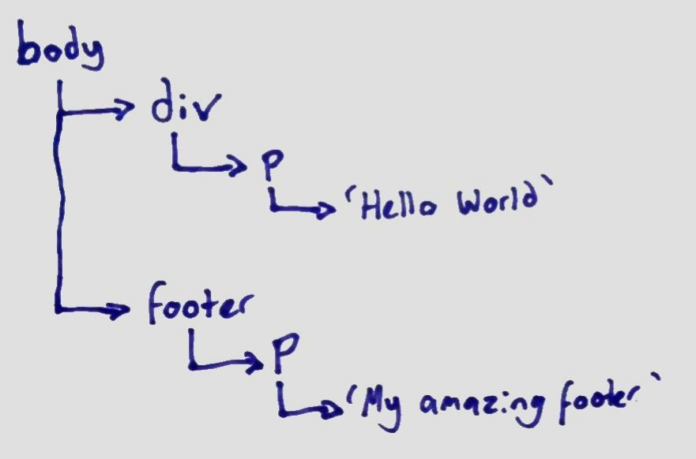

It's time to get into some gritty technical details about what is going on with
your HTML and specifically how does your browser interpret what it sees when it
reads the code that makes up your HTML.

## Enter the Document!

So when your browser downloads your HTML it converts the text into what we call
the 'Document'. Basically this is the 'live' version of your running website,
and this follows a standard pattern we call the 'Document Object Model' or DOM
for short. The DOM is 'computer legible' - i.e. something a computer can
understand - representation of the webpage, and defines how your CSS and
Javascript will work alongside it. The DOM is in effect a big tree, with
elements spanning out as branches and leaves of the tree. Consider the following
HTML:

```html
<body>
  <div>
    <p>Hello World</p>
  </div>
  <footer>
    <p>My amazing footer</p>
  </footer>
</body>
```

You should already know from the second lesson that HTML 'tags' can live inside
of other 'parent' tags, and here we have a `div` and a `footer` inside of the
`body` tag, and inside each of those is a `p` tag. You will also notice I have
formatted the text so that each thing that is in a parent is indented by two
blank spaces - this is very intentional and super good habit to get into. It
also shows you the tree, which looks like this:


